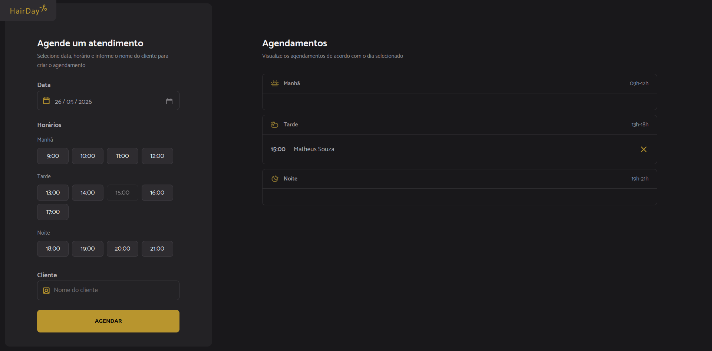

<p align="center">
  

<h1 align="center">💈 Hair Day 💈</h1>

<p align="center">
  Sistema de agendamento para barbearias e salões de beleza desenvolvido durante a formação <strong>Especialista Full Stack</strong> da Rocketseat.
</p>

---

## 📖 Sobre o projeto

O **Hair Day** é uma aplicação web para gerenciamento de agendamentos em barbearias e salões de beleza.

O sistema permite selecionar uma data, visualizar horários disponíveis em tempo real, criar novos agendamentos e cancelar horários já reservados.

O projeto foi desenvolvido com foco em:

- Arquitetura modular
- Manipulação avançada do DOM
- Consumo de API REST
- Organização escalável de código
- Experiência do usuário
- Responsividade
- Boas práticas com JavaScript moderno

---

## ✨ Funcionalidades

✅ Agendamento de horários  
✅ Cancelamento de agendamentos  
✅ Separação por períodos (manhã, tarde e noite)  
✅ Atualização dinâmica da interface  
✅ Validação de horários indisponíveis  
✅ Bloqueio de horários passados  
✅ Consumo de API REST com json-server  
✅ Manipulação de datas com Day.js  
✅ Interface responsiva  
✅ Atualização automática dos horários disponíveis

---

## 🖼️ Preview

### 💻 Desktop

<p align="center">
  

---

## 🚀 Tecnologias utilizadas

### Frontend

- HTML5
- CSS3
- JavaScript
- ESModules

### Ferramentas e ambiente

- Webpack
- Babel
- json-server
- Day.js

---

## 🧠 Conceitos praticados

Este projeto foi desenvolvido para praticar conceitos importantes do ecossistema frontend moderno:

- Modularização de código
- Manipulação do DOM
- Programação assíncrona
- Async/Await
- Event Delegation
- Fetch API
- Estruturação de projetos
- Responsividade
- Organização em camadas
- Componentização de comportamento
- Tratamento de erros
- Renderização dinâmica

---

## ⚙️ Como executar o projeto

### Clone o repositório

```bash
git clone https://github.com/Matheus-Souza97/HairDay.git
```

### Acesse a pasta

```bash
cd HairDay
```

### Instale as dependências

```bash
npm install
```

### Execute o servidor da API

```bash
npm run server
```

### Execute o projeto

```bash
npm run dev
```

---

## 🌐 API Fake

O projeto utiliza o **json-server** para simular uma API REST local.

### Endpoint utilizado

```bash
http://localhost:3333/schedules
```

---

## 📅 Regras de negócio

- Não permite horários passados
- Horários ocupados ficam indisponíveis
- Agendamentos são separados automaticamente por período
- Atualização automática da agenda após criação ou cancelamento

---

## 🎨 Layout

O projeto possui:

- Design responsivo
- Interface moderna
- Dark Mode
- Feedback visual para interações
- Scroll customizado
- Estados visuais de disponibilidade

---

## 📚 Aprendizados

Durante o desenvolvimento deste projeto foram praticados conceitos fundamentais para aplicações frontend modernas, como:

- Estruturação profissional de projetos
- Separação de responsabilidades
- Comunicação com APIs
- Manipulação de datas
- Atualização dinâmica da interface
- Arquitetura modular com JavaScript

---

## 👨‍💻 Autor

Feito por **Matheus Souza** durante a formação **Especialista Full Stack** da Rocketseat 🚀

---

## 📝 Licença

Este projeto foi desenvolvido para fins de estudo.
